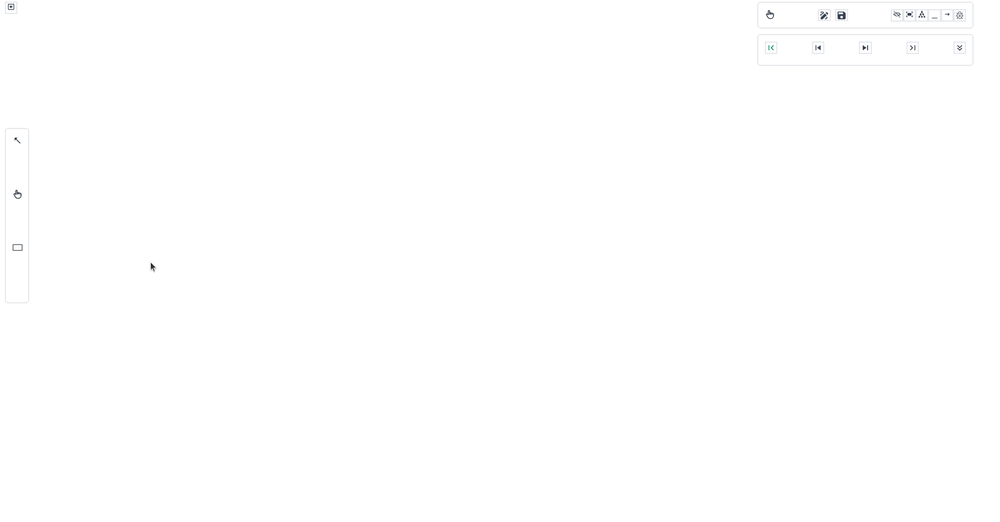
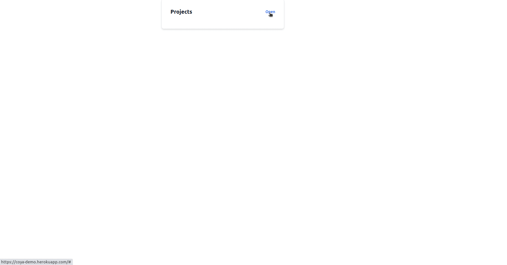

# Coya

<table>
<tbody>
    <td align="center">
     
    Status: <b>Beta 🎉</b> 
    Give it a star. It really motivates us 🤩
    
    </td>
</tbody>
</table>

Coya is a diagram drawing tool for developers.
The resulting diagram is just a JSON file, so you can:
- 🤓 commit it to git and compare it with the prev version
- 💡 generate a diagram from any programming language
- ✨ animate diagram, like in PowerPoint
- 🔨 use a powerful editor
- 🧰 use vscode extension (in development)

# Demo
You can try it [here](https://coya-demo.herokuapp.com/)

Here is example how to use it:

# Available blocks
- rectangles and arrows
- images
- code files
- iframes

# Sponsors

<table>
  <tbody>
    <tr>
      <td align="center" valign="middle">
        
      </td>
    </tr>
  </tbody>
</table>
